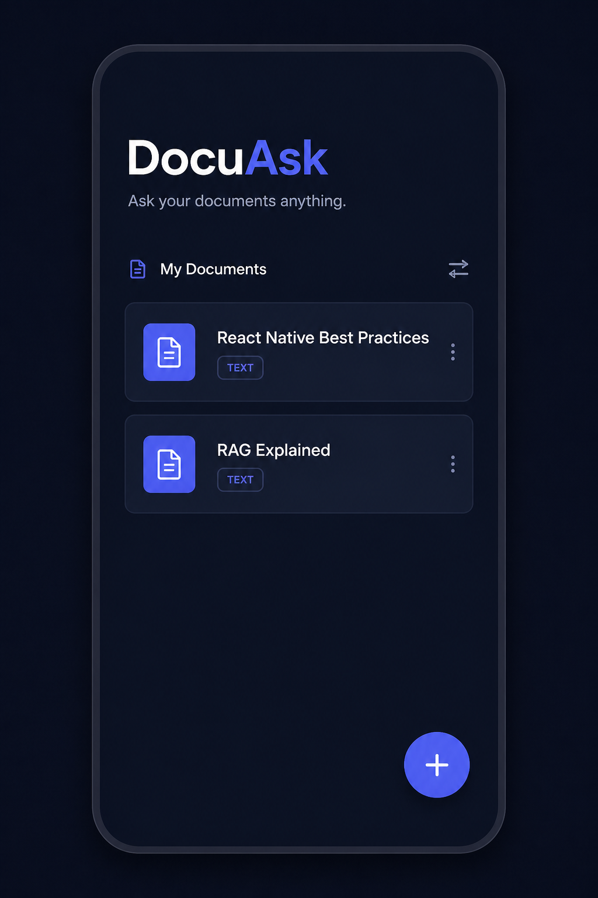
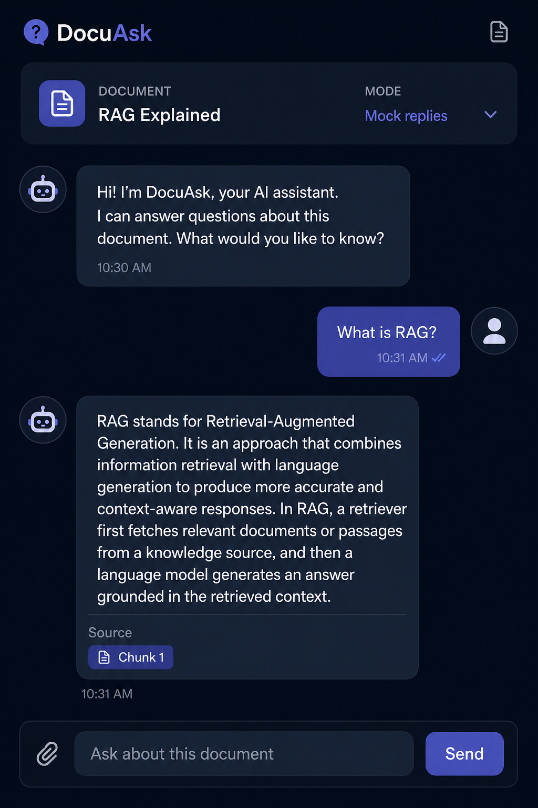
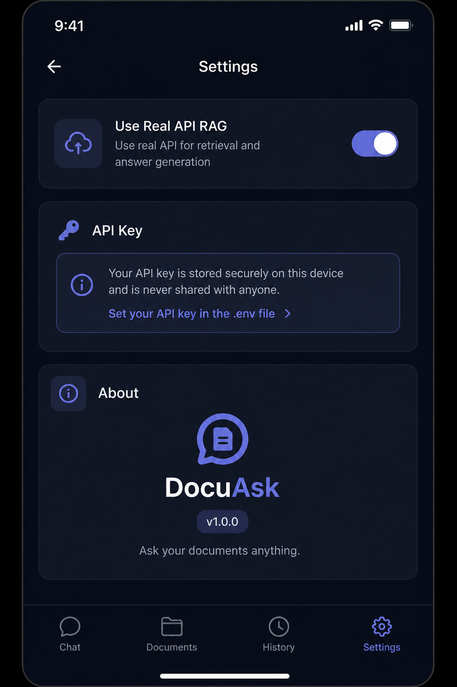
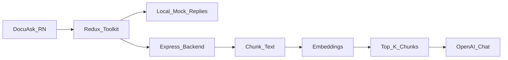

# AI_ChatBot
This is a new [**React Native**](https://reactnative.dev) project, bootstrapped using [`@react-native-community/cli`](https://github.com/react-native-community/cli).
# DocuAsk

**Ask your documents anything.**

DocuAsk is a React Native portfolio app for document Q&A. Paste or upload text, then chat with answers grounded in that document — first with on-device mock replies, then with a real RAG backend when you turn on Real API mode.

<p align="center">
  
  
  
</p>

## Features

- Document library with persistence (redux-persist)
- Add documents via paste or `.txt` file picker
- Chat with suggestion chips and source chips
- Mock mode for demos without an API key
- RAG mode via Express backend (chunk → embed → retrieve → generate)
- Settings toggle for Real API

## Architecture



## Tech stack

| Layer | Tech |
|-------|------|
| Mobile | React Native 0.86, TypeScript, React Navigation |
| State | Redux Toolkit, redux-persist, RTK Query |
| Forms | Formik + Yup |
| UI | StyleSheet, Poppins, indigo `#6366F1` theme |
| Backend | Express, OpenAI SDK, in-memory store |

## Demo flow

1. Open **DocuAsk** → see sample documents (or empty state CTA)
2. Tap **+** / **Add Document** → paste text → Save
3. Open a document → tap a suggestion chip or ask a question
4. Read the answer (mock mode shows local contextual reply + source chips)
5. Settings → enable **Use Real API** when backend is running

## Run the mobile app

```bash
npm install
npx react-native-asset   # link Poppins fonts
npm start
npm run ios              # or: npm run android
```

## Run the RAG backend

```bash
cd backend
cp .env.example .env
# Optional: set OPENAI_API_KEY
npm run dev
```

From the project root: `npm run backend`

Without an API key the API still answers using keyword retrieval + mock text.

## Project structure

```
src/
  Screens/AppScreens/   DocumentLibrary, AddDocument, DocumentChat, Settings
  Components/           EmptyState, MessageBubble, DocumentCard, Button, ...
  Navigation/           MainNavigation + header options
  Redux/                documents + settings slices, RTK Query APIs
  Utils/                theme, helper, constants, data, validation
  Assets/Brand/         DocuAsk icon
backend/
  src/                  Express RAG API
docs/screenshots/       Portfolio UI frames
```

## Modes

| Mode | Settings | Behavior |
|------|----------|----------|
| Mock | Use Real API = off | Local contextual replies from document text |
| RAG | Use Real API = on | Streaming `POST /chat/stream` + PDF upload via backend |

## RAG upgrades

- **Source chips** with tappable snippet previews
- **SSE streaming** answers in Real API mode
- **PDF / .txt upload** via `POST /documents/upload` (`pdf-parse`)


## QA

See [QA_REPORT.md](QA_REPORT.md) for endpoint and unit-test results.

```bash
npm test
cd backend && npm run qa && npm run qa:rag
```

## License

Private portfolio project.
